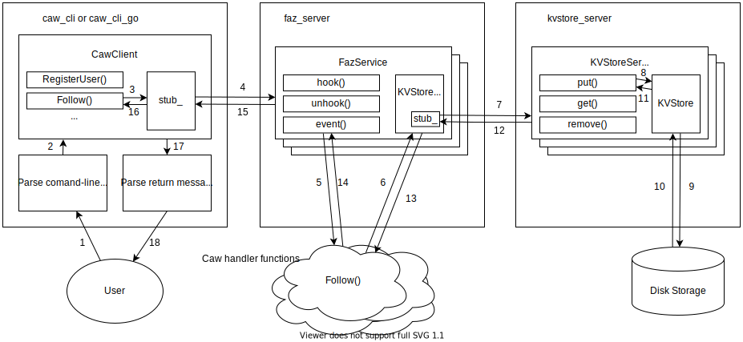

# csci499_chengtsu

<div>

[]()
[](/LICENSE)

</div>

An FaaS platform and a social network system on top of it. For USC CSCI499 - Robust Systems Design and Implementation.

## Architecture


As shown in the diagram, there will be three executables built in this project, they are:

- **caw_cli**: The Caw command-line tool who accepts the user's input, sends requests to 
the Faz Server through the `CawClient` accordingly, and displays response messages to the 
user based on the return from the Faz Server.

- **faz_server**: The Faz Server who hosts a `FazService`, which executes the corresponding
Caw handler functions based on the incoming event types, and sends back response messages. 
During the execution of Caw handler functions, interactions with a KVStore Server may occur,
through a `KVStoreClient`.

- **kvstore_server**: The KVStore Server who hosts a `KVStoreService`, which performs
put/get/remove operations to the underlying `KVStore` instance as requested, and sends back
response messages to remote callers.

What happens when you run the Caw command-line tool?

1. You enter arguments with flags to the command-line tool.
2. After parsing the arguments, if they are valid, the main function will call 
the corresponding `CawClient` functions.
3. The called `CawClient` function will make an RPC to the remote `FazService` running
on a Faz Server.
4. The RPC is made through a gRPC stub.
5. The `FazService` will execute the corresponding Caw handler function (if hooked)
in its `event()` function. If it's a hook/unhook request, it will run the `hook()`/`unhook()`
function instead, and in this case, we will jump to the step 13 directly.
6. The executing Caw handler function may make an RPC to the remote `KVStoreService` running
on a KVStore Server if needed. Note that you can also set the `FazService` to use a local 
`KVStore` instead of a remote `KVStoreService`. We just describe the case of remote service
here for generality.
7. The RPC is made through a gRPC stub embedded in a `KVStoreClient`.
8. The `KVStoreService` will call its `put()`/`get()`/`remove()` function accordingly to
interact with the underlying `KVStore`.
9. The `KVStore` returns results to the caller.
10. The `KVStoreService` sends back response message to the Caw handler function.
11. The response message is sent through the gRPC stub.
12. The Caw handler function returns on completion.
13. The `FazService` sends back response message to the `CawClient`.
14. The response message is sent through the gRPC stub.
15. The `CawClient` returns results to the main function.
16. The command-line tool will display messages to you via standard output based on the results.

## Pre-reqs
To build and run this app locally you will need a few things:
- Install **googletest**
- Install **gflags**
- Install **glog**
- Install **gRPC** and **Protobuf**

## Build
```
mkdir build && cd build
cmake ..
make
```

## Usage
To get the Caw platform work, you need to first start the KVStore server, 
and then start the FaaS server. Then you can use the Caw command-line tool
to use the Caw functionalities. 

Assume you are already in a directory containing the built executables.
Below are instructions to get the system work.

To run the KVStore server
```bash
./kvstore_server
```

To run the FaaS server
```bash
./faz_server
```

To use the Caw command-line tool for different purposes
- To hook all Caw functions: 
`./caw_cli --hook_all`

- To register a user: 
`./caw_cli --registeruser <username>`

- To follow another user on behalf of a user: 
`./caw_cli --user <username> --follow <to_follow>`

- To get a user's profile: 
`./caw_cli --user <username> --profile`

- To post a caw on behalf of a user: 
`./caw_cli --user <username> --caw <text>`

- To post a caw replying an existing caw on behalf of a user: 
`./caw_cli --user <username> --caw <text> --reply <parent_caw_id>`

- To read a caw thread starting from a caw: 
`./caw_cli --read <caw_id>`

- To unhook all Caw functions: 
`./caw_cli --unhook_all`

> **Note!** The command-line tool also supports chaining flags to enable you 
> to run multiple functions in one command for convenience. For example you
> can do some thing like
> ```bash
> ./caw_cli --hook_all --registeruser Reiner --user Reiner --follow Zeke \ 
>   --caw "I am the Armored Titan, he is the Colossal Titan" \
>   --profile --unhook_all
>```
